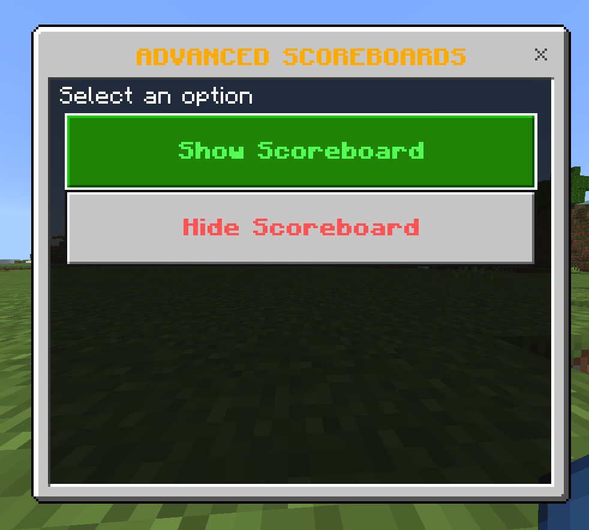
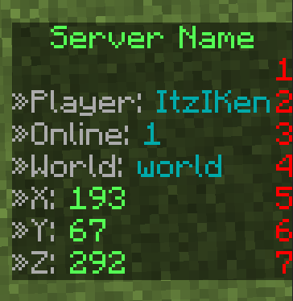

<div align="center">
  <a href="https://github.com/Akari-my/AdvancedScoreboard">
    
  </a>

  <h3 align="center">An advanced, fast and customizable scoreboard plugin for BetterAltay Servers</h3>

  <p align="center">
    The best lag-free alternative to ScoreHud,
    <br>
    without external tag install support!
    <br />
    <br />
    <a href="https://github.com/Akari-my/AdvancedScoreboard/issues">Report Bug</a>
    ·
    <a href="https://github.com/Akari-my/AdvancedScoreboard/issues">Request Tags</a>
    ·
    <a href="https://github.com/Akari-my/AdvancedScoreboard/issues">Request Features</a>
    ·
    <a href="https://github.com/SamuelPozzobon/AdvancedScoreboard">Ths is a Fork from Varion</a>
  </p>
</div>

### Features:
- [x] Recode The Plugin
- [] Highly customizable
- [] Fast
- [] Support to other plugins
- [] Random color text
- [] Scoreboard API and Configurable 
- [] Multi-World scoreboard support

### Plugin dependency (Your choice whether to put them or not):
- PurePerms 
- EconomyAPI
- FactionsPro
- CombatLogger
- KDR
- PreciseCpsCounter
- RedSkyBlock

## Commands
* /as

## Config.yml
<details>
  <summary>Click to open</summary>

```yaml
---
default: # DEFAULT | IF NO WORLDS ARE CONFIGURED WILL DISPLAY THIS FOR EVERY WORLD
  title:
    - '&cServer Name'
    - '&aServer Name'
  lines:
    - '§»'
    - '&7»Player: &3{NAME}'
    - '&7»Online: &3{ONLINE}'
    - '&7»World: &3{WORLDNAME}'
    - '&7»X: &a{X}'
    - '&7»Y: &a{Y}'
    - '&7»Z: &a{Z}'

worlds:
  world:
    title:
      - '&cServer Name'
      - '&aServer Name'
    lines:
      - '§»'
      - '&7»Player: &3{NAME}'
      - '&7»Online: &3{ONLINE}'
      - '&7»World: &3{WORLDNAME}'
      - '&7»X: &a{X}'
      - '&7»Y: &a{Y}'
      - '&7»Z: &a{Z}'
...
```
</details>

## ⚠️ ATTENTION READ
This plugin was written in API 3.28.0 for [BetterAltay](https://github.com/Benedikt05/BetterAltay) Servers

### a command that opens a UI:


### The scoreboard viewed in Game:


## Please leave a ⭐ to help the Project!
